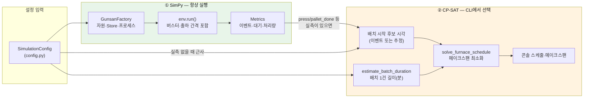
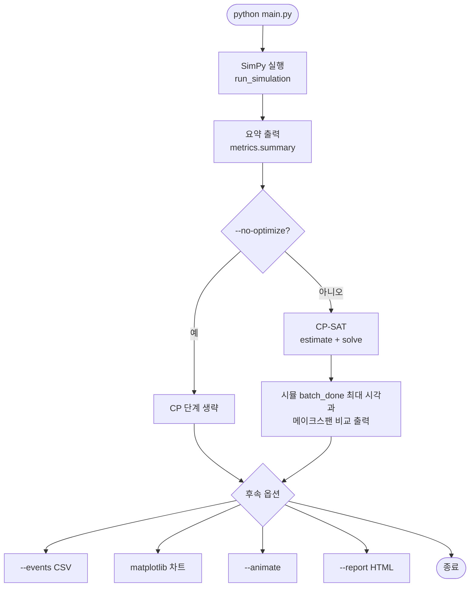
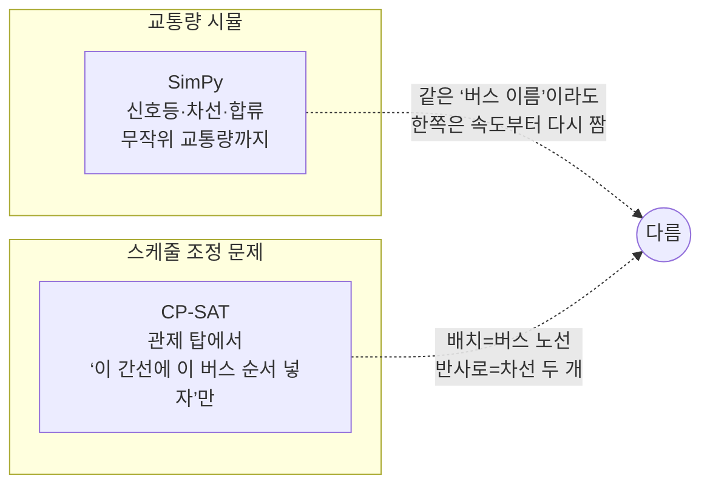

# SimPy 와 CP-SAT: 무엇이 다르고, 언제 쓰이는가

이 프로젝트는 **공장 전 과정 시간 흐름**을 위해 **SimPy**를 쓰고, CLI에서 선택적으로 **배치(반사로) 스케줄의 이론적 하한**을 보기 위해 **Google OR-Tools CP-SAT**를 씁니다. 두 도구는 **역할이 다르고**, **실행 순서도 다릅니다**.

---

## 1. 한눈에 비교

| 구분 | SimPy | CP-SAT (이 프로젝트의 활용) |
|------|--------|------------------------------|
| **본질** | 이산사건 시뮬레이션(DES): 자원 줄서기·버퍼·랜덤 출하까지 **시간 순서 재현** | 제약 만족 + 최적화: “배치를 두 반사로에 어떻게 넣으면 전체 완료가 가장 빠른가”를 **정수 계획**으로 풂 |
| **이 코드에서의 결과** | 이벤트 로그·KPI·버퍼 추이 등 **실제 운영에 가까운 동역학** | 동일 입력(배치 개수·길이·준비 가능 시각)이라면 가능한 한 **작은 메이크스팬**과 배치 시작 시각표 |
| **반사로 2대를 어떻게 보는가** | `Resource(capacity=2)`: 빈 반사로에 **먼저 잡히는 순**으로 간단 배정(**선착순 근사**) | 각 배치를 반사로 1 또는 2에 넣되, **겹치지 않게 배치 시작 시각까지 최적화** |
| **어디서 돌아가나** | `simulation.run_simulation()` — **항상** (`main.py`, `webapp.py` 공통) | 현재 코드 기준 **`main.py`만** (기본 활성, `--no-optimize` 로 끔). `webapp.py`에서는 **설명 패널**로만 소개되며 버튼 시뮬과는 연동 안 됨 |
| **파일** | `simulation.py` (+ `metrics.py`) | `optimizer.py` (+ `main.py`에서 호출) |

---

## 2. 시각화 — 전체 역할 분담

아래 그림에서 **왼쪽(녹색 계열)** 은 시간을 따라 공정을 **시뮬**하는 부분이고, **오른쪽(주황)** 은 시뮬이 끝난 뒤(같은 설정·같은 기간 안에서 도출된 **배치 단위 정보**만) **스케줄 표를 재해석**하는 부분입니다.



**읽는 법:** 시뮬레이션은 “공장 한 편”; CP-SAT는 “그 결과로부터 뽑은 **배치 리스트**에 대해, 반사로만 똑똑하게 짜면 얼마까지 줄일 수 있는지”를 따로 계산합니다.

---

## 3. 시각화 — `main.py` 실행 타임라인



---

## 4. SimPy — 언제·무엇을 위해 쓰이는가

- **언제:** `run_simulation()` 이 호출될 때마다 (CLI·웹 **동일**).
- **하는 일:**
  - 트럭 입고 간격·출하 간격(**확률** 포함)·계근대 **공유** 같은 **교차 영향**을 시간축 위에 놓음.
  - `Resource`, `Store` 로 **큐 길이·버퍼 full로 인한 정지** 같은 물류 현상 재현.
- **안 하는 일:**
  - “이 배치를 오늘 로 1번로로 보낼지 최적으로 정한다” 같은 **연구 수준 의사결정**은 두지 않고, 반사로는 비교적 단순한 **자원 할당 규칙**을 따름.

실제 진입점은 `simulation.py` 의 `run_simulation()` 에서 `Environment()` 를 만들고 워커를 등록한 뒤 `env.run(until=…)` 으로 시간을 전진시키는 부분이다.

```402:420:simulation.py
def run_simulation(cfg: SimulationConfig) -> Metrics:
    """주어진 설정으로 시뮬레이션을 실행하고 Metrics 객체를 반환한다."""
    rng = random.Random(cfg.random_seed)
    env = simpy.Environment()
    metrics = Metrics()
    factory = GunsanFactory(env, cfg, metrics, rng)

    # 5단계 워커 등록
    env.process(factory.truck_inbound_generator())
    for _ in range(cfg.sorting.sorters):
        env.process(factory.sort_worker())
    for _ in range(cfg.sorting.press_machines):
        env.process(factory.press_worker())
    for f in range(cfg.melting.furnace_count):
        env.process(factory.furnace_worker(furnace_id=f + 1))
    env.process(factory.outbound_truck_generator())

    env.run(until=cfg.sim_horizon_min)
    return metrics
```

---

## 5. CP-SAT — 언제·무엇을 위해 쓰이는가

- **언제:** `python main.py` 실행 시 **`--no-optimize` 없을 때만** `main.py`가 `optimizer`를 호출.
- **하는 일:**
  - **변수:** 각 배치의 시작 시각, 어느 반사로(1 또는 2)를 쓸지.
  - **제약:** 시작은 “파레트가 배치 분량만큼 준비된 시각(release)” 이후, 같은 반사로에서는 처리 구간 겹치면 안 됨.
  - **목표:** 모든 배치가 끝나는 시간(**메이크스팬**)을 줄임.
- **입력되는 “배치 시작 시각”은 어디서 오나:**
  1. 우선 시뮬 로그에서 `press` / `pallet_done` 이 누적되어 **실제 모인 시점**을 쓸 수 있으면 그걸 사용.
  2. 불가하면 `estimate_batch_releases(cfg)` 같은 **파이프 근사**로 시간만 추정 (**대기열·버퍼와 어긋날 수 있음**).

> **중요:** CP-SAT가 찾은 시작 시각표는 **실제 SimPy 재실행 결과가 아니라**, “반사로만 최적으로 돌린다면”이라는 **수학 모델의 해**입니다. 시뮬과의 차이가 곧 **선착순 근사 반사로 vs 최적 순서 바꿈**의 간극입니다.

---

## 6. 시각화 — 직관적인 비유



즉 SimPy는 **도로 자체 전체 재현**, CP-SAT는 **이미 버스 들이 줄 선대로 준비될 때**(release) 차선 두 개만 **순번 최적**.

---

## 7. 참고 및 관련 문서

| 자료 | 설명 |
|------|------|
| [simulation_inputs_constraints.md](simulation_inputs_constraints.md) | CP-SAT 블록(§5)·SimPy 제약까지 표로 연결 |
| [execution_flow_sequence.puml](execution_flow_sequence.puml) | CLI 단계별 순차도 (SimPy 실행 직후 CP-SAT 분기 포함) |
| [SimPy 문서](https://simpy.readthedocs.io/) | 이산사건 개념·Resource·Store |
| [OR-Tools CP-SAT 가이드](https://developers.google.com/optimization/cp/cp_solver) | `NoOverlap`, interval 변수 등 |

---

## 8. 웹 대시보드 사용자에게

브라우저에서 돌린 **그래프·KPI**는 모두 SimPy 결과입니다. 반사로 “최적 메이크스팬 비교”를 보려면 **`python main.py`** (또는 CP-SAT를 웹과 연결하는 별개 개발 필요) 로 CLI를 활용해야 합니다.

동일 요지의 **비교표·Mermaid 도식·요약**은 `webapp.py` 의 **「🔬 방법론 및 라이브러리」** 탭 상단(「SimPy · CP-SAT — 역할, 관계, 활용 시점」)에서도 볼 수 있다. 인터넷이 연결된 환경이어야 Mermaid CDN 렌더가 동작한다.
